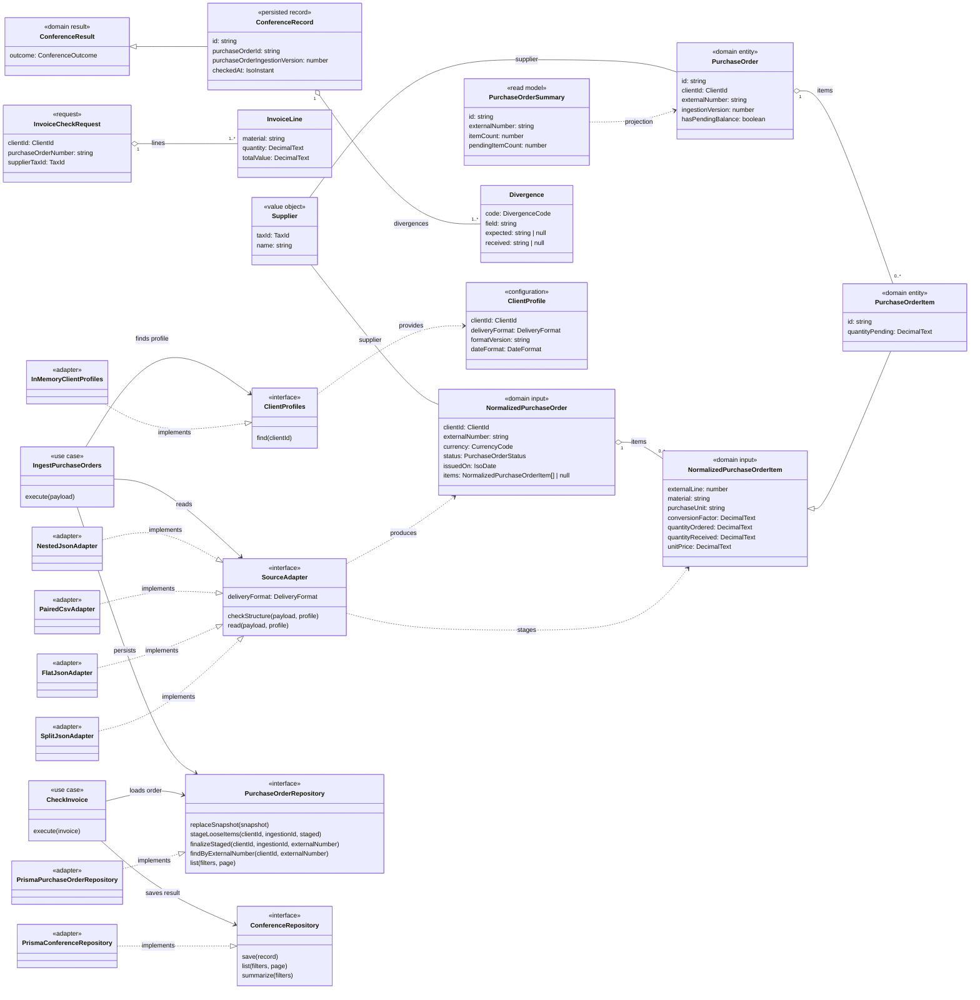

# Classes e contratos

Visão simplificada dos tipos centrais, casos de uso e portas. Este é um mapa de
leitura, não uma declaração de que todas as interfaces TypeScript são classes
concretas. A fonte da verdade é `src/domain/` e `src/application/ports/`.

